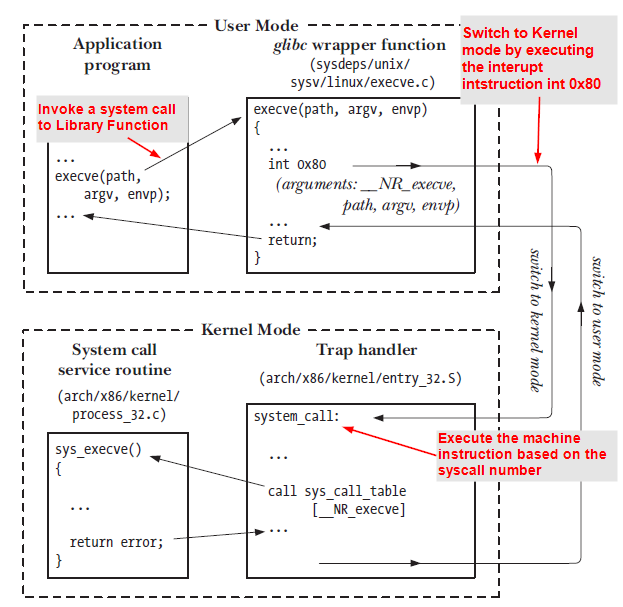
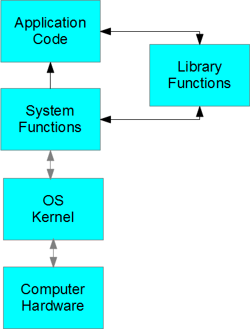

# System Programming Notes

## System Calls
- *System calls* (*syscalls*) - are functions invocation that made from user space into the kernel to request some service or resources from the OS.

- Example of system calls:
    - ```read()```, ```write()```, ```get_thread_area()```, ```set_tid_address()```, etc.

- A system call can be considered as a interface through which the User application code enters the Kernel mode.

- System calls can be invoked from user application in 2 ways:
    1. Directly calling the system call.
    2. The user code calls the library function, and this function invokes or calls the systems calls when required.



### Invoke Syscalls
- User mode applications are not allow to directly execute Kernel code or manipulate kernel data.
- Linux provides a set of syscall to pass control from User mode to Kernel mode.

## Kernel
- The core of the Operation System (OS).

## Library Functions
- A library is a collection of pre-compiled code.
- Library functions are designed over the system calls in order to provide more additional functionality in the library functions.



## File Permission

